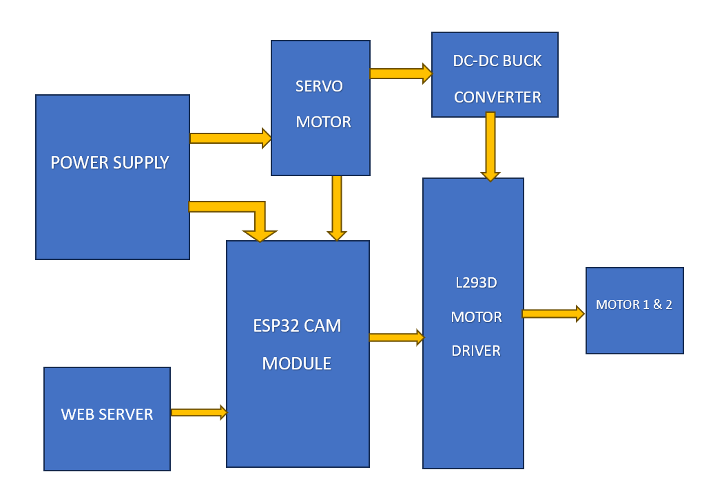
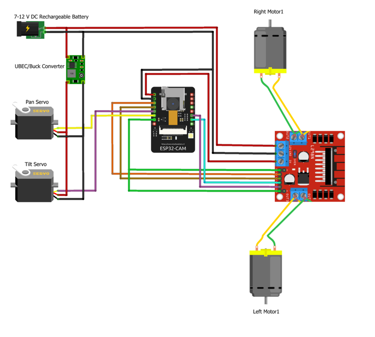

# ESP32-CAM-Surveillance-Car
A Wi-Fi controlled surveillance car using ESP32-CAM that provides real-time video streaming and remote vehicle control through a web browser..

---

## 🚀 Features

- Live video streaming from ESP32-CAM  
- Wi-Fi based control through a web browser  
- Forward, backward, left and right movement  
- DC motor control using L298N motor driver  
- Compact and portable robotic car  
- Can be extended with camera rotation (pan/tilt)  

---

## 🧰 Components Used

| Component | Quantity |
|---------|---------|
| ESP32-CAM Module | 1 |
| L298N Motor Driver | 1 |
| DC Geared Motors | 4 |
| Robot Car Chassis | 1 |
| Wheels & Tyres | 4 |
| Battery Pack (7–12V) | 1 |
| Jumper Wires | As required |
| LEDs (optional) | 1–2 |

---

## 🔌 Connections (ESP32-CAM → L298N)

| ESP32-CAM Pin | L298N Pin | Function |
|--------------|----------|----------|
| GPIO 12 | IN1 | Motor 1 direction |
| GPIO 13 | IN2 | Motor 1 direction |
| GPIO 14 | IN3 | Motor 2 direction |
| GPIO 15 | IN4 | Motor 2 direction |
| 5V | +5V | Motor driver logic power |
| GND | GND | Common ground |
| Battery + | 12V | Motor supply |
| Battery – | GND | Motor ground |

Motors connect to **Motor A and Motor B outputs** of the L298N module.

---
## 🧱 Block Diagram

## 🔌 Circuit Diagram

## 🧠 How It Works

1. ESP32-CAM connects to Wi-Fi and starts a web server  
2. A live camera stream and control buttons appear in the browser  
3. When a control button is pressed, ESP32-CAM sends signals to the motor driver  
4. L298N drives the motors to move the robot  
5. Camera continuously streams live video

---

## 📱 How to Use

1. Upload the ESP32-CAM code using Arduino IDE  
2. Power the ESP32-CAM and motor driver  
3. Connect your phone or laptop to the same Wi-Fi network  
4. Open the ESP32-CAM IP address in a browser  
5. Use the on-screen buttons to move the car  
6. Watch live video from the camera

---

## 🎬 Demo Video

Watch the working surveillance car here:  
https://drive.google.com/file/d/1OaWxUCKzRXuvz3Rfqf5f2HU-AKh8tLy0/view?usp=sharing

---

## 🎯 Applications

- Home and office security  
- Surveillance and monitoring  
- Spy robot  
- Warehouse inspection  
- Educational IoT projects  

---

## 🔮 Future Improvements

- Camera pan and tilt using servo motors  
- Night vision support  
- Cloud video storage  
- Face detection  
- Mobile app control  

---

## 👨‍💻 Author

**Akshitha**  
ESP32 | IoT | Embedded Systems
